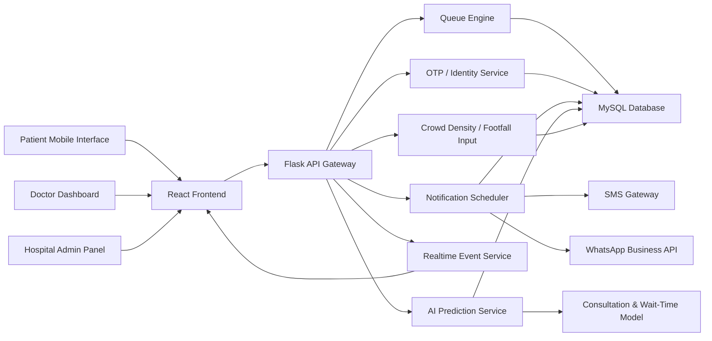

# Smart OPD Queue Management System

Smart OPD is a hospital-ready queue orchestration platform designed to reduce overcrowding, shorten visible waiting lines, and lower nosocomial infection risk in Indian OPD environments. The system predicts consultation delays, notifies patients by SMS or WhatsApp 20 to 30 minutes before their likely turn, and gives doctors and administrators real-time visibility into queue health.

## 1. System Architecture

### Core Stack

- Frontend: React + HTML + CSS
- Backend: Python Flask REST API
- Database: MySQL
- Notification layer: SMS / WhatsApp API such as Twilio, Gupshup, or MSG91
- AI module: Python ML service for consultation-time and wait-time prediction
- Realtime updates: WebSocket or Server-Sent Events
- Analytics: MySQL aggregates + Python reporting jobs

### Architecture Diagram



### Scalability Notes

- Department-wise queues isolate load by OPD specialty.
- Flask services can be containerized and scaled horizontally behind Nginx.
- MySQL uses indexed queue tables and read replicas for analytics.
- Notification jobs run asynchronously via Celery or RQ workers.
- WebSockets stream queue updates without constant polling.
- AI retraining runs nightly using historical consultation data.

## 2. User Interface Design

### Patient Interface

- Mobile-first registration with name, age, mobile number, department, and priority category
- OTP verification and digital token generation
- Live queue position, estimated waiting time, and doctor delay banner
- Notification status timeline: scheduled, sent, delivered, read, arrived
- Just-in-time arrival instruction with hospital gate and OPD room details
- Support for elderly, pregnant, immunocompromised, and emergency fast-track handling

### Doctor Dashboard

- Today’s consultation list with live queue
- Start, pause, break, delay, and consultation-complete actions
- Predicted next-patient arrival readiness
- Overridden wait times if emergency patient inserted
- Delay reason capture for audit and analytics

### Hospital Admin Panel

- Multi-department queue monitoring
- Doctor availability and bottleneck detection
- Crowd density heat view for OPD areas
- Notification command center
- No-show, delay, occupancy, and throughput analytics

## 3. System Workflow

1. Patient registers through kiosk, receptionist desk, or mobile interface.
2. System validates mobile number with OTP.
3. Queue engine generates a digital token and maps the patient to a department and doctor slot.
4. Backend stores patient, appointment, queue token, and notification preferences.
5. AI service predicts consultation duration using doctor history, department, patient category, and live OPD load.
6. Queue engine calculates expected waiting duration and assigns notification window.
7. Notification scheduler queues an SMS or WhatsApp alert 20 to 30 minutes before the expected turn.
8. Doctor dashboard updates status as consultation begins, pauses, or gets delayed.
9. If doctor delay or emergency insertion changes ETA, queue engine recalculates downstream wait times.
10. System reschedules notifications in real time and informs affected patients.
11. Patient arrives just-in-time, checks in, and is marked ready.
12. Admin dashboard logs outcomes for analytics, staffing optimization, and infection-control reporting.

## 4. AI Component Design

### Inputs

- Doctor average consultation time
- Department type
- Patient age band and priority category
- Live queue length
- Day of week and hour of day
- Delay events and no-show probability
- Historical consultation variance

### Outputs

- Predicted consultation duration per patient
- Estimated waiting time per token
- Notification lead time recommendation

### Model Approach

- Baseline: Gradient Boosting Regressor or Random Forest Regressor
- Features: doctor_id, department, age_group, priority, slot_hour, queue_length, historical_avg_duration, delay_minutes, no_show_score
- Retraining: nightly batch run
- Inference: triggered on new registration, doctor status change, consultation completion, and emergency insertion

### Lead-Time Logic

- If wait uncertainty is low and distance to hospital is short: notify 20 minutes before turn
- If wait uncertainty is high or peak crowd is detected: notify 30 minutes before turn
- If doctor delay exceeds threshold: push revised notification immediately

## 5. Database Design

### Core Tables

- `patients`
- `doctors`
- `appointments`
- `queue_tokens`
- `notifications`
- `doctor_status_logs`
- `crowd_density_events`

### Schema Snapshot

```sql
patients(patient_id, full_name, age, gender, mobile_number, preferred_language, priority_category, created_at)
doctors(doctor_id, full_name, department, room_number, avg_consultation_minutes, status, delay_minutes)
appointments(appointment_id, patient_id, doctor_id, appointment_date, slot_time, check_in_status, consultation_status)
queue_tokens(token_id, appointment_id, token_number, queue_status, queue_position, predicted_wait_minutes, predicted_consultation_minutes, notification_lead_minutes)
notifications(notification_id, token_id, channel, scheduled_at, sent_at, delivery_status, template_name, message_preview)
```

## 6. Algorithm Logic

### Queue Management

```text
For each department:
1. Fetch active doctor status and open tokens.
2. Separate tokens into emergency, elderly/high-risk, and normal queues.
3. Merge queues using weighted priority rules:
   emergency > elderly/high-risk > normal
4. Preserve fairness with anti-starvation:
   after N priority insertions, release one normal token if safe.
5. Recompute queue positions and ETA after every event.
```

### Priority Handling

- Emergency patients move to immediate or next-safe consultation slot.
- Elderly and infection-vulnerable patients receive shortened on-site wait exposure.
- Manual override requires audit trail and admin visibility.

### Real-Time Updates

- Event triggers: registration, check-in, doctor start, consultation complete, break, delay, no-show, emergency insert
- Each event recalculates queue state, ETA, and notification schedule
- WebSocket pushes updated state to all active dashboards

### Notification Scheduling

```text
lead_time = dynamic_window(predicted_wait, uncertainty, travel_time, crowd_density)
send_at = expected_consultation_start - lead_time

If send_at <= now:
    send immediate alert
Else:
    enqueue notification job

If ETA shifts by more than threshold:
    reschedule pending notification
    send update message if already delivered
```

## 7. UI Layout Wireframes

### Patient Interface

```text
+--------------------------------------------------+
| Smart OPD | Token #A-142 | ETA 24 min           |
+--------------------------------------------------+
| Doctor: Dr. Meera Nair   | Dept: General OPD    |
| Status: Notification sent | Arrival: 11:20 AM   |
+--------------------------------------------------+
| Live Queue                                        |
| Your Position: 4                                  |
| Current Token: A-138                              |
| Delay Alert: Doctor running 8 min late            |
+--------------------------------------------------+
| [Track Queue] [Update Mobile] [Hospital Map]     |
+--------------------------------------------------+
```

### Doctor Dashboard

```text
+--------------------------------------------------+
| Dr. Meera Nair | Room 3 | Status: Active        |
+--------------------------------------------------+
| Current Patient: A-138 | Started: 10:52 AM      |
| Next Patient: A-142    | ETA arrival: 11:18 AM  |
+--------------------------------------------------+
| Queue: Emergency 1 | Elderly 2 | Normal 9       |
| [Complete] [Delay +10m] [Break] [Call Next]     |
+--------------------------------------------------+
| Live Queue Table                                  |
| Token | Patient | Priority | ETA | Notif Status  |
+--------------------------------------------------+
```

### Admin Panel

```text
+----------------------------------------------------------------+
| Smart OPD Operations Center                                    |
+----------------------------------------------------------------+
| Live OPD Load | Avg Wait | Active Doctors | Crowd Risk Level   |
+----------------------------------------------------------------+
| Department Grid                                                |
| General OPD | 32 waiting | Avg 18m | Density Moderate          |
| Cardiology  | 18 waiting | Avg 26m | Density High              |
+----------------------------------------------------------------+
| Alerts                                                         |
| - 24 patients need revised notifications                       |
| - Dr. Rao delayed by 20 min                                    |
| - East waiting hall density crossed threshold                  |
+----------------------------------------------------------------+
```

## 8. Additional Innovation

- Crowd density monitoring using CCTV analytics, Wi-Fi presence, or BLE beacons
- Predictive OPD scheduling based on day-of-week patterns and doctor productivity
- Infection-risk aware waiting guidance for elderly and immunocompromised patients
- Multilingual notifications for Hindi, English, Tamil, Telugu, Bengali, and Marathi
- Analytics dashboard for no-show rate, average delay, load balancing, and notification effectiveness
- Integration-ready hooks for ABDM, HIS, and EMR systems used in India

## 9. Project Implementation Plan

### Phase 1: Foundation

1. Build React dashboards and shared design system.
2. Build Flask APIs for patients, doctors, queues, and notifications.
3. Create MySQL schema and seed sample hospital data.
4. Integrate OTP and notification providers.

### Phase 2: Intelligence

1. Train baseline ML model using historical consultation data.
2. Add ETA prediction API and notification lead-time logic.
3. Add doctor delay rescheduling and no-show handling.

### Phase 3: Operations

1. Add WebSocket realtime queue broadcasting.
2. Add analytics dashboards and crowd density ingestion.
3. Add audit logs, RBAC, and hospital branch management.

### Phase 4: Production Readiness

1. Deploy frontend on Vercel or Nginx and backend on Docker or Kubernetes.
2. Configure TLS, backup, monitoring, and alerting.
3. Run pilot in one OPD, validate reduction in crowd density and wait visibility.

## 10. Suggested Folder Layout

```text
smart-opd/
  frontend/
    src/
      components/
      pages/
      services/
      styles/
  backend/
    app.py
    queue_engine.py
    notification_service.py
    ai_client.py
  ai/
    wait_time_model.py
    training_sample.csv
  database/
    schema.sql
    seed.sql
```

## 11. India Deployment Considerations

- Support WhatsApp-first communication due to high adoption in India.
- Keep SMS fallback for feature phones and low-data users.
- Support multilingual UI and notification templates.
- Build for intermittent connectivity at registration desks.
- Use audit logs for NABH and hospital quality reporting needs.
- Respect patient privacy and local data-governance policies.

## 12. Deployable Application Status

This repository now contains a deployable full-stack application shape:

- React frontend that consumes live backend APIs
- Flask backend with queue, tracking, notification, doctor, and admin endpoints
- MySQL-ready schema and seed scripts
- Dockerfiles for frontend and backend
- `docker-compose.yml` for frontend, backend, and MySQL together
- `docker-compose.prod.yml` for HTTPS-terminated production deployment
- Staff authentication, admin audit trail, and doctor-only queue access controls
- Notification provider layer with safe `mock` mode plus Twilio, MSG91, Gupshup, or generic webhook routing
- Visit outcome handling for `completed`, `no_show`, and `cancelled` OPD turns
- Safer MySQL-backed runtime behavior with backend request-time state sync
- Live queue refresh over Server-Sent Events for patient, doctor, and admin dashboards
- Appointment date and slot-time booking across patient, doctor, and admin workflows
- OTP verification flow for patient mobile validation before registration, with live provider delivery support
- Self check-in with generated check-in codes and QR-ready payloads
- Dedicated kiosk mode for lobby/front-desk arrivals with persisted checked-in counts
- Multilingual patient notifications and guidance based on preferred language

## 13. Staff Authentication

The backend now uses a real `users` table with hashed passwords, role checks, session invalidation, and password reset tokens.

- Roles supported: `admin`, `doctor`, `staff`
- Passwords are stored as hashes, not plain text
- Access tokens include `session_version`, so password or role changes invalidate older sessions
- Password reset tokens are stored separately in `password_reset_tokens` with expiry and single-use tracking

### Seeded Staff Accounts

- Admin: `admin@smartopd.local` / `Admin@123`
- Doctor: `doctor.cardiology@smartopd.local` / `Doctor@123`
- Doctor: `doctor.general@smartopd.local` / `Doctor@123`
- Staff: `staff.frontdesk@smartopd.local` / `Staff@123`

### Auth APIs

- `POST /api/auth/login`
- `GET /api/auth/me`
- `POST /api/auth/forgot-password`
- `POST /api/auth/reset-password`
- `GET /api/admin/users`
- `POST /api/admin/users`
- `PATCH /api/admin/users/<user_id>`

## 14. Notification Provider Configuration

- Default local mode is `NOTIFICATION_MODE=mock`, which marks alerts as delivered without calling an external vendor.
- OTP defaults to `OTP_MODE=mock`, but it can use live vendor delivery with `OTP_MODE=live`.
- For a live Twilio setup, set:
  - `NOTIFICATION_MODE=live`
  - `SMS_PROVIDER=twilio`
  - `WHATSAPP_PROVIDER=twilio`
  - `TWILIO_ACCOUNT_SID`
  - `TWILIO_AUTH_TOKEN`
  - `TWILIO_SMS_FROM`
  - `TWILIO_WHATSAPP_FROM`
- For live MSG91 SMS alerts or OTP delivery, set:
  - `NOTIFICATION_MODE=live`
  - `OTP_MODE=live`
  - `OTP_PROVIDER=msg91`
  - `SMS_PROVIDER=msg91`
  - `MSG91_AUTH_KEY`
  - `MSG91_SMS_FLOW_ID`
  - `MSG91_SMS_FLOW_MESSAGE_VAR`
  - optional `MSG91_SMS_SENDER`, `MSG91_SMS_ROUTE`, `MSG91_SMS_TEMPLATE_ID`
- For live Gupshup delivery, set:
  - `NOTIFICATION_MODE=live`
  - `OTP_MODE=live`
  - `OTP_PROVIDER=gupshup`
  - `SMS_PROVIDER=gupshup` and/or `WHATSAPP_PROVIDER=gupshup`
  - `GUPSHUP_API_KEY` plus `GUPSHUP_WHATSAPP_SOURCE` for WhatsApp
  - `GUPSHUP_SMS_USER_ID` plus `GUPSHUP_SMS_PASSWORD` for SMS
  - optional `GUPSHUP_SMS_SENDER`, `GUPSHUP_SMS_ENTITY_ID`, `GUPSHUP_SMS_TEMPLATE_ID`
- For hospital middleware or local gateway integration, set `SMS_PROVIDER=webhook` or `WHATSAPP_PROVIDER=webhook` and provide:
  - `SMS_WEBHOOK_URL`
  - `WHATSAPP_WEBHOOK_URL`
  - or a shared `NOTIFICATION_WEBHOOK_URL`
- OTP uses the same provider abstraction, so one-time passwords can be delivered over MSG91 SMS or Gupshup SMS/WhatsApp while verification still remains application-controlled.
- The current built-in MSG91 adapter targets SMS flow delivery. For WhatsApp reminders, use Gupshup or Twilio.
- Admin APIs:
  - `GET /api/admin/notification-config`
  - `GET /api/admin/deployment-readiness`
  - `GET /api/admin/provider-diagnostics`
  - `POST /api/admin/provider-test`
  - `POST /api/admin/notifications/dispatch`
  - `GET /api/admin/audit-logs`
- Provider callback API:
  - `POST /api/webhooks/notifications/<provider>`
  - Supports generic payload fields such as `notification_id`, `provider_message_id`, `message_id`, `status`, `delivery_status`, `event`, `error`, and `timestamp`
  - Protect with `PROVIDER_WEBHOOK_TOKEN` or a provider-specific token like `MSG91_WEBHOOK_TOKEN`

### Main API Endpoints

- `GET /api/bootstrap`
- `GET /api/admin/persistence`
- `POST /api/patients/register`
- `GET /api/patients/track?q=<query>`
- `POST /api/patients/<patient_id>/action`
- `POST /api/doctors/<doctor_id>/complete`
- `POST /api/doctors/<doctor_id>/call-next`
- `POST /api/doctors/<doctor_id>/status`
- `POST /api/doctors/<doctor_id>/emergency-insert`
- `POST /api/admin/simulate-tick`

### Local Run

1. Start with Docker Compose: `docker compose up --build`
2. Frontend will be available at `http://localhost:3000`
3. Backend API will be available at `http://localhost:5000/api`
4. Local defaults live in [backend/.env.example](C:/Users/gs784/OneDrive/Documents/New%20project/backend/.env.example)

### Current Scope

- The app is production-shaped and deployable with Docker.
- Backend now supports optional MySQL-backed snapshot persistence using the included schema and containers.
- By default, it can still run safely in memory if MySQL is unavailable.
- Check `GET /api/admin/persistence` or `GET /api/health` to confirm whether the app is in `memory` or `mysql` mode.

### Enabling MySQL Persistence

1. Set `MYSQL_ENABLED=1` in [backend/.env.example](C:/Users/gs784/OneDrive/Documents/New%20project/backend/.env.example) or your real backend env file.
2. Start the stack with `docker compose up --build`.
3. The backend will load from MySQL if data exists, otherwise it will bootstrap demo data and persist it into MySQL.

## 15. Production Deployment Separation

- Copy [backend/.env.production.example](C:/Users/gs784/OneDrive/Documents/New%20project/backend/.env.production.example) to `backend/.env.production` and fill only the non-secret settings.
- Copy [frontend/.env.production.example](C:/Users/gs784/OneDrive/Documents/New%20project/frontend/.env.production.example) to `frontend/.env.production` if you want a standalone frontend build.
- Put real secrets in files under [deploy/secrets/README.md](C:/Users/gs784/OneDrive/Documents/New%20project/deploy/secrets/README.md) instead of committing them to git.
- Set your production hostname in [deploy/nginx/prod.conf.template](C:/Users/gs784/OneDrive/Documents/New%20project/deploy/nginx/prod.conf.template) or via the `PUBLIC_HOSTNAME` environment value in [docker-compose.prod.yml](C:/Users/gs784/OneDrive/Documents/New%20project/docker-compose.prod.yml).
- Provision TLS certificates into `deploy/certs/live/<your-domain>/fullchain.pem` and `privkey.pem`.
- Start the production stack with `docker compose -f docker-compose.prod.yml up --build -d`.
- Use `GET /api/admin/deployment-readiness` after login to confirm which go-live blockers are still open.
- Use `GET /api/admin/provider-diagnostics` to inspect which OTP, SMS, and WhatsApp secrets are configured and whether they are coming from environment variables or secret files.
- Use `POST /api/admin/provider-test` for dry-run checks or controlled live test messages before enabling production patient traffic.
- Wire delivery receipts from providers into `POST /api/webhooks/notifications/<provider>` so sent notifications can transition to `delivered`, `read`, or `failed` with provider message IDs persisted in MySQL.
- Production routing assumptions:
  - HTTPS terminates at Nginx
  - `/` proxies to the React frontend
  - `/api/*` proxies to Flask
  - `/api/events/stream` keeps SSE buffering disabled for live queue updates
